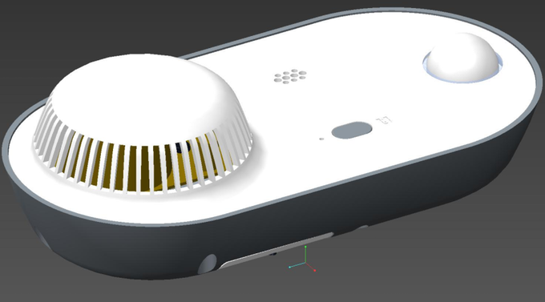
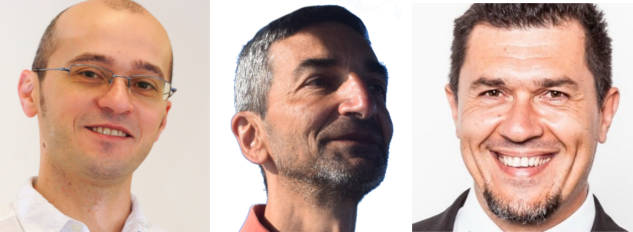

## About
We had a dream. We wanted to build an IoT device that improves the safety in our house and respects our freedom. A device that allows us legally to modify and extend it to our own needs. And is not just bunch of ugly cables and Printed Circuit Boards(PCB) but has the look and feeling of a finished device made with love.

We couldn't find such an IoT device; therefore, we gathered a small team of passionate professionals and in the last year and a half we built U:Kit. U:Kit is a sensor kit that has motion detection, smoke detection and WIFI functionality, and you can extend it by either programming it or downloading new firmware for it.

## License
All components needed to build and operate U:Kit are under open source license. This repository is containing links to all projects
that are included in U:Kit. You will find the following
* pcb/ - contains all Printed Circuit Boards(PCB) electronic files needed to create them.
* enclosure/ - contains all 3D models needed to build the plastic enclosure.
* firmware/ - contains the firmware for all microcontrollers that are part of U:Kit.

## U:Kit - a powerful sensor kit
U:Kit is a sensor kit that can help you improve the safety and security in your house while allowing you to modify and extend it to your own needs.

U:Kit is easy to assemble, has a plastic case, and can be attached to the ceiling and used with minimum efforts also from non-technical savvy people. But that is just the tip of the iceberg.

## U:Kit features
U:Kit can be used out of the box to track movement or detect smoke in your house. While not a certified motion or smoke detector it can be used as a capable companion. Out of the box U:Kit will work similar to a smoke detector and will raise an alarm if a smoke is detected.

But what if you wanted more? Even without software or a hardware knowledge with the help of a mobile phone you will be able to change the mode in which U:Kit is working and make it act similar to a

* (Mode: Smoke) this is the default mode in which the device can detect smoke and signal an alarm without connecting to Internet.
* (Mode: Alarm) similar to the previous mode plus at the same time the device will detect motion.
* (Mode: Smart Alarm) the device detects smoke or motion and informs you immediately via Internet about the changes in your house
* (Mode: Smart Protection) device detects smoke or motion and silently informs you about them via Internet.

## The team
Our initial team consists of a software engineer, a hardware guru, a star designer and mechanical designer.

* Slavey Karadzhov <slav@attachix.com>  is the software engineer and the main driving force behind this project. Long time supporter of Free Software and the open source and hardware movement and creator of (local) communities around it. Working since quite some time in the software industry and contributing to multiple free/open source software projects to make them more useful and improve their quality.

* Cviatko Delchev <cviatko@attachix.com>  is our hardware guru. Working with hardware since his early years he creates industrial hardware devices that are smart, functional and rock solid. Assembler programming for him is "high-level" programming.

* Ilian Milinov <ilian@attachix.com> is our star designer. Actually a four star Red-Dot award winner, something like four times Oscar winner, and he was the one to built the U:Kit external design as part of his passion and desire for designing beautiful and useful (Io)Things.

* Pavel Ivanov <pavel@attachix.com> is the mechanical designer guru that made all those great 3D models.

## Contribute
Just fork the project that you are interested in and send us your Pull Request.
For a full list of contributors to this repository take a [look here](https://github.com/attachix/ukit/graphs/contributors).
Every individual project that is part of U:Kit has its own list of contributors. Make sure to check them too.

## Copyright
Unless otherwise stated this project and all of it sub-projects are copyright:

(c) 2016 - 2018 - Slavey Karadzhov <slav@attachix.com>
